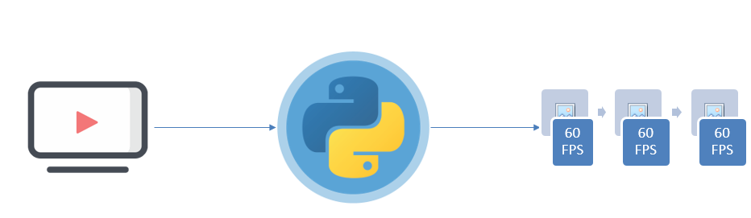
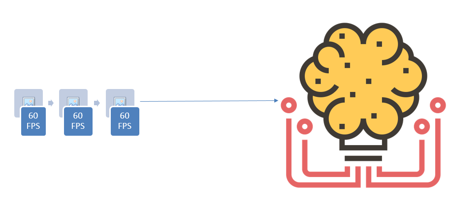
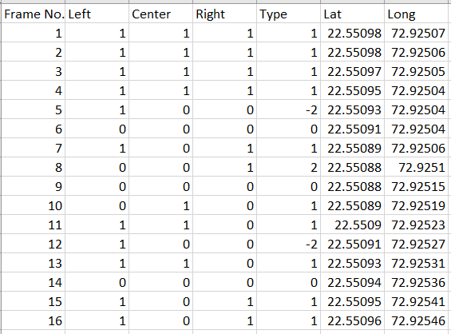
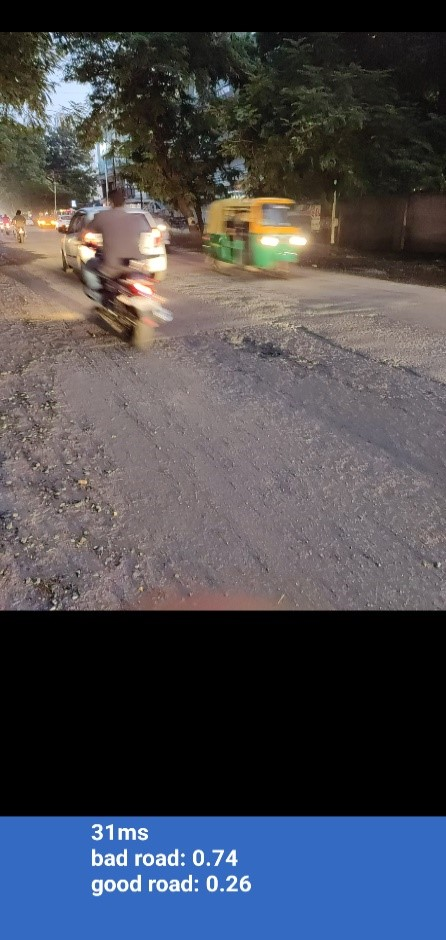
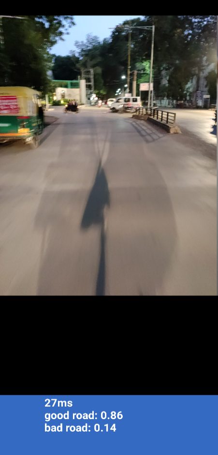
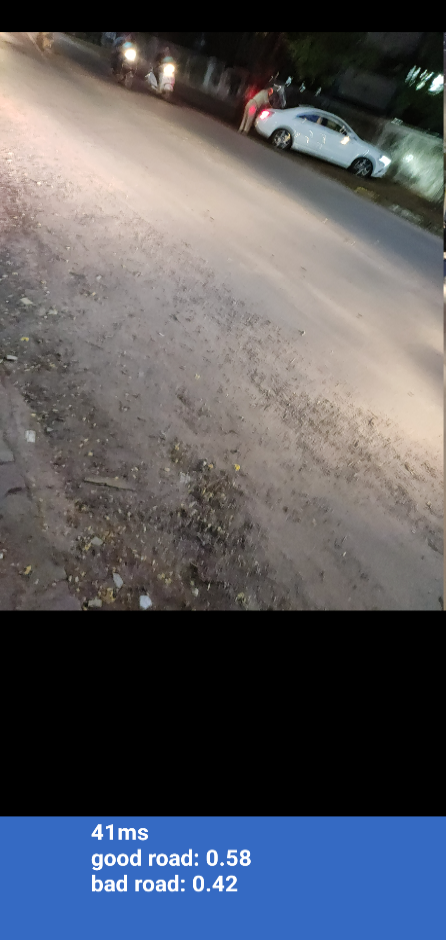
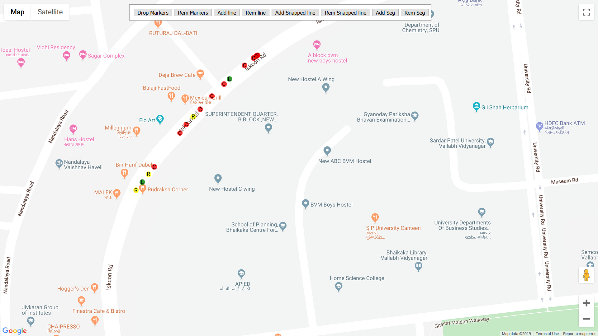
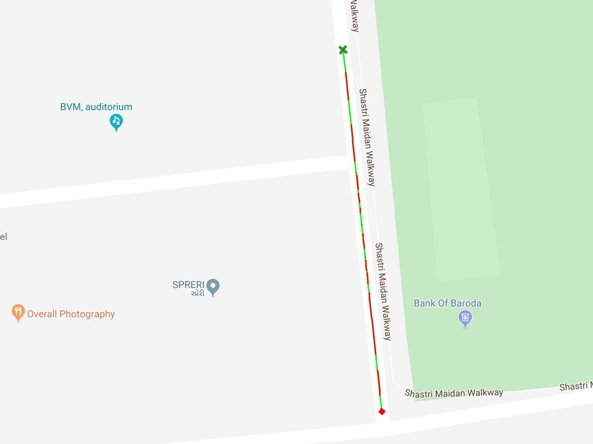

# Introduction
As the main motivation behind this project is the less time finding the problem and more time solving the problem and avoiding major loss of money, energy, resources and human lives because of the bad condition of the road. The Road Analyzer System is the system provides automated way to analyze the condition of road instead to doing it manually. All user has to do is capture a video with the GPS coordination of the road she/he wants to analyze and give that as an input to system rest is taken care by the system. This system uses various state of the arts technologies such as DL and CNN, image processing, GPS, cloud technology and web technology, it also uses hardware modules such as GPS module and camera modules.

# Workflow of System:

Figure 1: Using android to record locations and capture video at the same time

Figure 2: Dividing video into different frames

Figure 3: Giving each frame to CNN for classification

Figure 4: Associating result of the classifier with location file and logging that into the JSON file

Figure 5: Giving json record to API to be plotted on map 

# Modules:
1.	Input: Refer to RoadHouse : https://github.com/rajputchintan22/RoadHouse

2.	Processing:  in this the input files are preprocessed and converted into form in which our model will take input, then they are fine-tuned and synchronized with each other. After all the requirements are met then it is given to our CNN which then identifies the damage in the road in the video also logs the time at which it captured damage, then the log file is given to the another script which matches the damage logged time with location log and generates the file with color coded representation of the damaged and good road beside the location coordinates latitude and longitude.

3.	Mapping: That color coded location’s file is then given to maps API which will map those locations with their respective color on the map, this file can be store and accessed via cloud over the internet by common people as well as government employees and official to give the real time information about condition of road, which will then help them on planning and prioritizing the  repair work of the road, this data can also be accessed by public to know the condition of the road coming ahead while their driving on it and major accidents can be avoided.

We aim to create a system with simplest user interface so that anyone can use it and make it modularized and open to use it with any peripherals of their choice. Also providing different views to different users such as for common people only warning them and painting road ahead of them as red as appose to green in their navigation system would be sufficient but for government employees we create view with point on which the road is bad and also provide them with more than two color schemes to signify the amount of damage on the road. The system also allows the crowd sourcing so the public on themselves can analyze the road and make data public and keep the data up-to date.

